# dengeX Remote mimarisi ve gerçek uygulama durumu

17 Eylül 2026 — Aşama 0 geliştirme teslimatı; Aşama 0 kabul kapısı henüz açık.

## Çalışan mevcut hat

```mermaid
flowchart LR
  UI[Tauri 2 + React/Vite] -->|yalnızca sabit test komutları| R[Rust deney yürütücüsü]
  R -->|görünür pencere / yerel onay| S[Swift ScreenCaptureKit]
  S --> V[VideoToolbox H.264]
  V -->|sınırlı binary pipe| A[WebRTC uç A]
  A -->|ICE + DTLS/SRTP / aynı bilgisayar| B[WebRTC uç B]
  B -->|RTP yeniden birleştirme / 3 kare kuyruk| D[VideoToolbox decode]
  D --> N[AppKit native yüzey]
```

Bu hat gerçek ekranı işler; kayıt veya örnek video kullanmaz. Sentetik codec testi ayrı adlandırılır ve raporunda `syntheticSource: true` bulunur. `transport` testi yalnızca SCTP/DTLS veri kanalını doğrular. SDP iki güvenilen yerel nesne arasında değişir. Uzak istemci bağlantısı, signaling servisi veya teknisyen hesabı yoktur. H.264 verileri React state/JSON/base64 üzerinden geçmez.

Capture ve video alt sistemleri tamamlanmış bir uzaktan masaüstü motoru değildir: webrtc-rs 0.20.5 yalnızca taşıma işini yapar; ScreenCaptureKit ve VideoToolbox bu depoda ayrıca bağlanmıştır. Native görüntü AppKit yüzeyinde sunulur. Tauri webview video render performansı doğrulanmadığı için o yol kullanılmaz.

## Hedef kontrol düzlemi — henüz bağlı değil

Next.js yönetim → Go API/WSS → PostgreSQL (tenant RLS) + Redis → OIDC sağlayıcısı. Cihaz ajanı kendi anahtarını OS kasasında üretir; teknisyen Authorization Code + PKCE ve zorunlu MFA ile giriş yapar. Cihaz ve kullanıcı kapsamı doğrulanınca imzalı, iki DTLS fingerprint'ine bağlı kısa ömürlü grant üretilir. Yerel müşteri onayı veya ayrıca açılmış cihaz parolası doğrulamasından sonra medya ve input açılır.

Bu sonraki akışın tamamlandığı iddia edilmez. `SessionGate` imza/kapsam/izin/süre/tekrar denetimlerini uygular ve test edilir; gerçek enrollment, OIDC ve capture başlatma ile bağlanmamıştır. Replay cache şu an süreç belleğindedir; üretim entegrasyonunda yeniden başlatmada yeni boot nonce ve/veya kalıcı replay kaydı gerekir. Aynı kısıt Go test adaptörleri için de geçerlidir.

## Bileşen durumu

| Sınır | Mevcut durum |
|---|---|
| apps/desktop | Türkçe Tauri 2/React uygulaması; izin sorgusu, dört yerel test, açık/koyu tema |
| native/platform-macos | Gerçek capture/encode/decode/native render; kendi penceresinde Unicode/fare denemesi |
| native/transport | İki yerel WebRTC uç noktası, H.264 track, veri kanalı, doğrulanmış yerel zorunlu TURN/UDP; TCP/TLS açıkça desteklenmiyor |
| native/agent-core | İmzalı grant doğrulama, izin kesişimi, <=60s lease, replay ve input parser denetimleri |
| native/platform-windows | Gerçek DXGI ve Unicode SendInput adaptörleri; derleyici kontrolü, native çalışma testi yok |
| services/api | Sağlık HTTP servisi; güvenlik domain çekirdeği ve race testleri; ürün rotaları açıkça 503 |
| services/api/migrations | Tenant kapsamlı şema taslağı; PostgreSQL 17 üzerinde migration, RLS ve geri yükleme testleri geçti |
| services/signaling | Belgelenmiş modül sınırı; WSS uygulaması henüz yok |
| packages/protocol | Tipler, native giriş JSON şeması ve gerçek sağlık API'si OpenAPI sözleşmesi |
| infra | Yerel bağımlılık Compose taslağı; production dağıtımı değil |
| apps/admin-web | Henüz oluşturulmadı; native kabulden sonra Next.js paneli |
| packages/ui | Ortak UI çıkarımı native kabulden sonraya bırakıldı |

## Kaynak ve yaşam döngüsü sınırları

- Ekran testi: görünür native pencere, yerel başlatma, Durdur/pencere kapatma, en fazla 60 saniye capture; consent bekleme dahil parent toplam süre sınırı.
- ScreenCaptureKit `queueDepth=3`; gelen IPC access unit üst sınırı 4 MiB; dönen video kuyruğu 3 access unit; native render coalescing.
- RTP yeniden birleştirme toleransı 1024 paket / 100 ms. İlk 32 paket sınırı 1080p anahtar kareleri düşürdü; başarısız deneme raporu saklandı. Üretim için kayıp/PLI ve backpressure ayrıca çalışılacak.
- Deneme zamanlaması RTP örneklerini nominal 30 fps ile damgalar; gerçek capture PTS adaptasyonu ve ağ temelli kalite değişimi henüz yapılmadı.
- Deneme bitişinde peer close çağrılır; TURN fixture konteyneri finally bloğunda kapatılır. Cihaz başına kontrol kilidi için PostgreSQL kısmi unique indeks tasarlanmıştır; gerçek oturum katmanı bağlı değildir.
- Demo ağ sunucusu, sahte destek kimliği, saklı kalıcı erişim, otomatik başlangıç, uzaktan shell veya gizli kayıt yoktur.

## Yerel cihaz kimliği ve macOS izin akışı

18 Eylül düzeltmesinde ayrı `dx-device-identity` helper’ı CryptoKit Ed25519 anahtarı, UUID ve oluşturma tarihini tek Keychain generic-password kaydında tutar. SecItemAdd yarışında kazanan kayıt okunur; kilitli/bozuk kayıt değiştirilmez. UI yalnızca public metadata alır. `DX-` kimliği public key SHA-256 özetinin ilk 64 bitinin okunur sunumudur; yetkilendirme sırrı değildir, server-side kayıt ve çakışma kontrolü halen gereklidir. Anahtar kopyası algılama ve cihaz kaydı henüz bağlı değildir.

Yerel ekran testi butonu açık yerel onaydır. Önce helper’ın gerçek TCC durumu sorgulanır; izin yokken `blocked` raporu hemen döner. Sabit izin türleriyle ayrı komut CGRequestScreenCaptureAccess / AXIsProcessTrustedWithOptions çağırır ve ilgili Sistem Ayarları sayfasını açar. TCC veritabanına yazılmaz, izin atlanmaz. Başlatılmış capture boyunca native pencere ve Durdur görünürdür. Başarısız native raporları transport ve Tauri sınırlarından korunarak UI’a taşınır; focus/izin yenileme hata mesajını temizlemez.

Platform referansları: [Apple Keychain](https://developer.apple.com/documentation/security/adding-a-password-to-the-keychain), [CryptoKit Signing.PrivateKey](https://developer.apple.com/documentation/cryptokit/curve25519/signing/privatekey), [CGRequestScreenCaptureAccess](https://developer.apple.com/documentation/coregraphics/cgrequestscreencaptureaccess()).

## Pilot 2: Windows gönderici

Windows ilk DXGI output'unu yalnızca yerel kabul ve imzalı grant doğrulandıktan
sonra açar. COM ve Media Foundation tek native işçide çalışır. BGRA görüntü
1280×720 sınırında NV12'ye dönüştürülür; inbox H.264 encoder Baseline profil,
düşük gecikme ve periyodik keyframe ile Annex B üretir. Parametre setleri RTP
sample'ına eklenir. Native WebRTC üzerinden gönderilen kareler JavaScript'e
aktarılmaz. Worker iptal, yerel monoton süre ve kapanan sınırlı kanal ile durur.
Windows uygulama kapanışı ayrıca stop işaretini ayarlar.

Alıcı Mac, Windows davetini girer; Mac'in ekran izni istenmez. Alıcı WebView
WebRTC yüzeyi kullanır. Davet oluşturma ve yerel kabul ekranları platforma
özgü yön varsaymaz. Sunucudaki opt-in guest oda oluşturma akışı mevcut odalara
ve yönetim API'sine erişim vermez; 6/dakika ve 8 açık oda sınırları vardır.

Kaynaklar: [Microsoft H.264 encoder](https://learn.microsoft.com/en-us/windows/win32/medfound/h-264-video-encoder),
[Annex B sequence header](https://learn.microsoft.com/en-us/windows/win32/medfound/mf-mt-mpeg-sequence-header-attribute).
